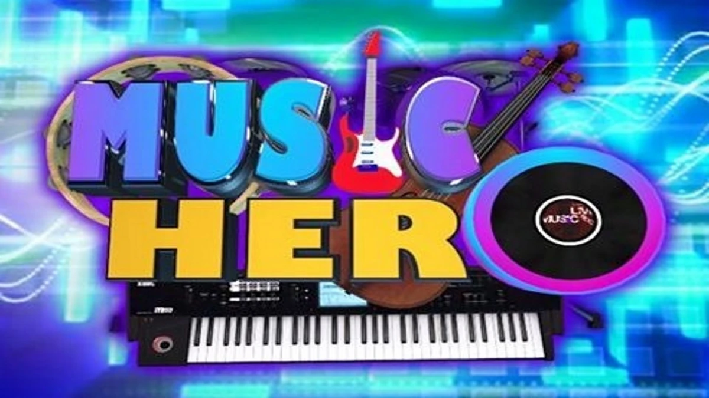

# Music Hero (built by [AutoCode](https://autocode.work) in 20 minutes)

This project aims to create a web-based platform for music composition, offering tools and resources
for musicians and composers.



[Live Demo](https://music-composer.netlify.app/)

## Features

-   Interactive music notation editor
-   Virtual instrument library
-   Chord progression generator
-   Melody suggestion tool
-   Real-time collaboration for ensemble compositions
-   Audio playback and export functionality
-   AI-powered composition assistance

## Technology Stack

-   React.js for front-end development
-   Chakra UI for responsive design
-   Web Audio API for sound generation and processing
-   Tone.js for advanced audio synthesis and effects
-   react-router-dom v6 for routing

## Design Considerations

-   Responsive design for desktop and mobile use
-   Intuitive user interface for both beginners and professionals
-   Scalable architecture to support future feature additions
-   Optimized performance for handling complex musical data
-   Modular component structure for easier maintenance and testing
-   Accessibility features for users with disabilities
-   Dark mode support for reduced eye strain during long composition sessions
-   Offline mode capabilities for composing without an internet connection
-   Progressive Web App (PWA) implementation for improved performance and offline access
-   WebGL-based visualizations for enhanced user experience
-   Integration with cloud storage services for seamless backup and sync
-   AI-powered composition assistance using machine learning models
-   Social media integration for sharing compositions and collaborations
-   Version control system for tracking composition history and reverting changes
-   Integration with music education resources and tutorials
-   Microservices architecture for improved scalability and maintainability
-   Real-time audio processing for low-latency playback and recording
-   Integration with music streaming platforms for inspiration and reference
-   Gamification elements to encourage user engagement and learning
-   Collaborative filtering for personalized music recommendations
-   Integration with MIDI devices for hardware-based composition input
-   Blockchain-based copyright management for user-generated content
-   Virtual reality (VR) support for immersive composition experiences

## Roadmap

1. Implement basic notation editor and virtual instrument library
2. Develop chord progression and melody suggestion algorithms
3. Add real-time collaboration features
4. Implement audio export functionality
5. Integrate AI-powered composition assistant
6. Enhance UI/UX based on user feedback
7. Implement offline mode and local storage
8. Add support for custom instrument samples
9. Develop a mobile app version for on-the-go composition
10. Implement PWA features
11. Integrate WebGL-based music visualizations
12. Develop social sharing and community features
13. Implement version control system for compositions
14. Integrate music education resources and tutorials
15. Implement microservices architecture
16. Add real-time audio processing capabilities
17. Integrate with popular music streaming platforms
18. Implement gamification features
19. Develop collaborative filtering recommendation system
20. Add support for MIDI device integration
21. Implement blockchain-based copyright management
22. Develop VR composition mode

## Getting Started

1. Clone the repository
2. Install dependencies: `npm install`
3. Start the development server: `npm start`

## Project Structure

```
music-hero/
├── package.json
├── .prettierrc
├── public/
│   ├── index.html
│   ├── landing.html
│   └── _redirects
├── src/
│   ├── components/
│   │   ├── NotationEditor.js
│   │   ├── InstrumentLibrary.js
│   │   ├── ChordProgression.js
│   │   ├── MelodySuggestion.js
│   │   └── CollaborationSpace.js
│   ├── hooks/
│   │   └── useAIIntegration.js
│   ├── App.js
│   └── index.js
└── docs/
    ├── landing_page_copy.html
    └── social_media_content.json
```

## Contributing

We welcome contributions from the community. Please read our contributing guidelines before
submitting pull requests.

## License

This project is licensed under the MIT License - see the LICENSE file for details.

## Acknowledgments

-   Thanks to all the open-source libraries and tools that made this project possible
-   Special thanks to the music composition community for their valuable feedback and suggestions

# TODO

-   Fix play button everywhere
-   Fix endless loop of play